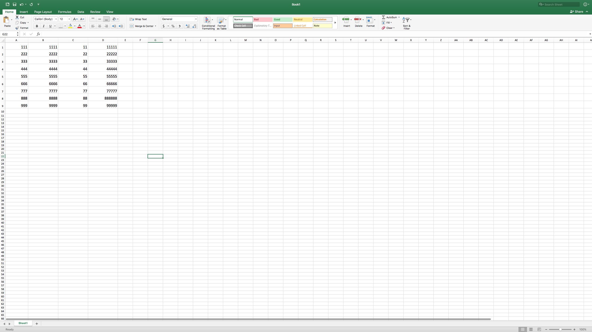
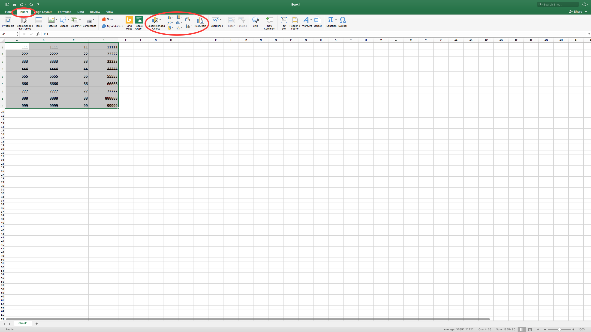
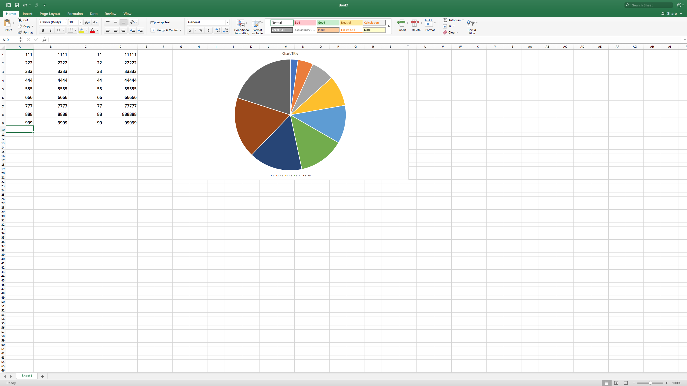

## Lesson Abstact
A simplified tutorial showing students how to create a graph on excel.
## Lesson Objectives/Outcomes
1. Student will be able to set up a chart.
1. Student will be able to insert data into a chart
1. Student will be able to label data
1. Student will be able to design the chart
1. Student will be able to compare the data 

## Materials

Microsoft Excel and a Microsoft Excel compatible device.

## Overview

Students at pierce generally have a hard time using the microsoft office program, Excel. This information became understood through the surveys we distributed for our pierce hacker project. Over 2/3 of our survey participants rated their comfortability with microsoft excel below average. Understanding this lack in basic technological wisdom, we feel compelled to provide students with a simple tutorial showing them how to create graphs on microsoft excel.

## Lesson Steps/Components [as many as needed]
1. Open blank excel spreadsheet.
1. Input your data into excel.
1. Highlight your data by moving the mouse from the beginning of your data to the end of your data.
1. Click the insert tab, and in the charts section choose one of nine graph and chart options to make.
1. Adjust your data’s color’s and layout if applicable.
1. Reorder and put a title on the graph upon personal desires.

## Photos

* Input your data.

* Highlight your data by moving the mouse from the beginning of your data to the end of your data, then click the insert tab, and in the charts section choose one of nine graph and chart options to make.

* Adjust your data’s color’s and layout if applicable.

## Credits, Further Reading, etc.

* Barron, Brenda. “40 Microsoft Excel Tutorials That'll Blow Your Mind And Impress Your Boss Tomorrow.” Digital.com, Digital.com, 28 Mar. 2019, digital.com/blog/excel-tutorials/.

